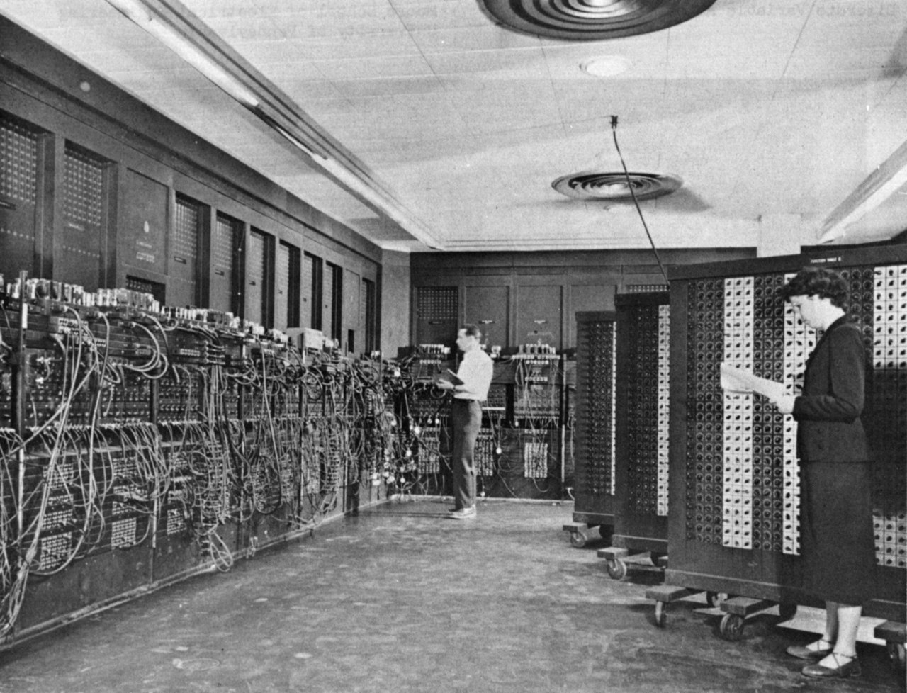

# 创世纪

如果把计算机发展史类比到人类历史上，那么浏览器登上舞台前的岁月对于前端开发者来说可能都属于上古而遥不可及的创世纪。

但计算机发展至今不过百年，却成为了像水和电一样重要的基础建设，而且很多互联网的祖师爷身子依然硬朗。我们也算是别样的历史见证者，我实在不想省略这百年间如此精彩的历史。在这一篇文章里，我会尽力去描绘这段精彩无比的创世纪，也会尝试卖弄一下学问，穿插一些有趣的小故事。

当然，碍于笔者稀碎的历史水平和文学造诣，我并无意于把整个维基百科都照搬过来，也无法保证内容的完全准确，各位看官也就图一乐。

## 计算机的诞生

让我们把时间倒回战火纷飞的二战时期。美国军方为了提高炮弹的精准度，需要结合炮弹、风向、气压甚至是重力加速度等一大堆参数绘制弹道轨迹表，而当时的手摇式计算器已经无法满足这么庞大的计算需求了。正所谓色情和暴力是人类进步的阶梯，得益于愚蠢的战争，1946 年，世界上第一台通用电子计算机 ENIAC 在美国宾夕法尼亚大学诞生了。给 ENIAC 添加“通用”定语是因为在它之前还有一台简称为 ABC 的电子计算机，但 ABC 并非图灵完备，不可编程，只能用来求解线性方程组，不被认为是普遍意义上的计算机。

::: tip ENIAC 和 ABC 的专利纠纷
ENIAC 的发明人约翰·莫齐利 (John Mauchly) 曾近距离接触过 ABC，并且据传约翰·莫齐利直接浏览了 ABC 的设计图纸。这影响了莫齐利之后关于 ENIAC 的工作，由此引发一系列的专利纠纷。1973 年，美国地方法院判决 ENIAC 的专利无效，法官拉尔森明确表示：“埃克特和莫齐利并非他们自己首先发明了自动电子数字计算机 (指 ENIAC)，而是继承了约翰·文森特·阿塔纳索夫的发明 (指 ABC)。”
:::

ENIAC 使用莱布尼茨 (Gottfried Wilhelm (von) Leibniz) 发明的二进制计算作为理论基础，以真空管 (Vacuum Tube，中国大陆常被译为电子管，此处与维基百科保持一致使用真空管) 为载体，能够实现每秒 5000 次的简单加减运算。

我们都知道，计算机能够进行的计算有且只有加法，并且只能进行二进制数的计算。ENIAC 选用真空管就是因为真空管在通电或断电后拥有不同的导电状态，因此就能够根据是否导电来代表 0 和 1，这样每个真空管就能代表一个二进制位，将其组合就能得到不同的二进制数，从而进行二进制计算。

::: tip 补充
上面这段对计算机计算原理的描述是极度简练且不准确的。首先，并非所有的计算机都采用了二进制方式进行计算，比如三进制计算机就使用 1, 0, -1 作为数字系统；其次，这部分内容实在过于硬核，笔者能力有限，不敢瞽言妄举，只是尝试把现代主流计算机的计算原理用一句话进行了概括。
:::

真空管体积大，功耗高，发热大，易损坏，这也使得 ENIAC 体积巨大，耗电惊人。但现在我们常用的笔记本电脑可比 27 吨重的 ENIAC 轻便无数倍了。是因为笔记本里的真空管做小了吗？事实上在现在的日常生活中我们已经很难见过真空管了，一部分真空管的工作被威廉·肖克利 (William Bradford Shockley) 发明的晶体管所替代，而手机、电脑乃止冰箱里的计算单元则进化成为了各种式样的芯片，比如 CPU，GPU 等。

这些进化都要归功于 1958 年罗伯特·诺伊斯 (Robert Norton Noyce) 发明的集成电路。你可能没有听说过诺伊斯这个名字，但一定听过他后来创办的公司：Intel。

## “八叛徒”和硅谷

在诺伊斯创办 Intel 之前，还有一段颇为精彩的故事。1955 年，晶体管之父威廉·肖克利创办了肖克利半导体实验室，吸引了大批才子加盟。但肖克利的性格和企业管理手段很快引起员工不满，其中包括诺伊斯在内的 8 人决定一同辞职。肖克利一直以导师身份自居，这种集体辞职行为在他眼里看来简直是忘恩负义，后来这群人被肖克利称为 “8 个叛徒” (Traitorous eight)。随后，这 8 人一同创办了仙童半导体公司。

仙童半导体坐落于旧金山南部，成立半年后就实现了盈利。再而后，曾经的 “叛徒” 们又纷纷出走创业，诺伊斯、摩尔 (就是摩尔定律那个摩尔) 和格鲁夫创办了 Intel，桑德斯创办了 AMD，瓦伦丁成立了红杉资本... 这些现在耳熟能详的巨头公司在当时也带动了大批公司入驻仙童半导体所在的旧金山南部，后来这片地区有了新的别名：硅谷。

::: tip 旧金山的来历
美国的大部分中文地名都采用音译，但 San Francisco 却被译为“旧金山”而不是港澳台同胞常用的“三藩市”。这是因为 19 世纪后期加州兴起淘金潮，大量华工居住在此，因此把这里称为“金山”。后来澳大利亚的墨尔本附近发现金矿，为了区分墨尔本，San Francisco 改称“旧金山”。
:::

## 互联网的诞生

时间来到 1968 年，美国国防部基于冷战的背景 (看吧，又是愚蠢的战争)，琢磨着搞一套能让世界各地的计算机相互通信的技术，简称 ARPANET，也就是俗称的 "阿帕网"。

1969 年，ARPANET 正式投入使用，最先加入的是美国 4 所大学的主要计算机。1969 年 10 月 29 日，加州大学洛杉矶分校和斯坦福大学进行了基于 ARPANET 的第一次通讯，但仅仅传输了 `LO` 两个字母。这是因为本来打算传输 `LOGIN`，结果传输到第三个字母时系统崩溃了。

在借助互联网首次发送问候 (LO 亦可代表 Hello) 之后，ARPANET 迅速发展，1972 年已经有 40 个节点加入。可能有人会好奇那时候的人们依靠互联网到底在做什么，其实加入 ARPANET 的节点大多数是美国高校，并且受限于各种“落后的条件”，当时的互联网大部分都用在学术目的上，比如收发电子邮件，或者通过 FTP 交换文件等。

随着节点数量越来越多，ARPANET 使用的 NCP 协议已经慢慢地不满足需求。而后由文顿·瑟夫 (Vinton Gray Cerf) 和罗伯特·卡恩 (Robert Elliot Kahn) 共同发明的 TCP/IP 协议则奠定了现代互联网的基石。

TODO：补充 TCP/IP 内容。

在下一个时间点到来前还有个值得一提的事情。1987 年，中国大陆发出了第一封电子邮件，这被看作是中国大陆与外界互联网的首次连接。邮件内容是：

> Across the Great Wall we can reach every corner in the world.

以现在的视角来看，这句话似乎带有着那么一丝“前瞻性”，毕竟现在真的出现了第二座长城。

## 万维网的诞生

时间继续前进。1989 年，英国科学家蒂姆·伯纳斯-李 (Tim Berners-Lee) 发明了万维网。万维网希望使用通过链接的形式把互联网上的各种资源进行组合，让使用者更方便得获取互联网上的各种资源。万维网是互联网的子集，属于一种更上层的“互联”方式。

我们先设想一个应用场景。假如你现在想要了解一下股票，大概会先打开浏览器，打开百度 (或者 Google)，然后输入股票两个字，敲回车，百度的页面上就会罗列出一大堆股票相关的网页。这时你看到有个知乎的回答看起来不错，于是你点击标题，浏览器带你来到了知乎的网站下。仔细想想这个操作，如果所有的网站都这样链接起来，互联网的边界是不是看起来触手可及？

::: warning 珍爱生命，远离百度
这里只是举个例子，请务必不要使用百度搜索股票、金融、医疗等相关内容，尤其是你的百度账号已经绑定了手机号时。
:::

能达到这样的效果，还要归功于伯纳斯-李的另外两个发明：超文本传输协议 (HTTP) 和超文本标记语言 (HTML)。我们能看到的任何一个网页，本质上都是浏览器借由 HTTP 请求从网络上的某一个地方取回了一段 HTML 代码，然后浏览器逐行翻译这些代码，就形成了我们能看到的网页。

早期的互联网哪有什么搜索引擎，大家想要访问某个网站，只能直接输入IP 地址或者链接进入。这也就促成了当时黄页、导航页和门户网站的大火，比如国外的雅虎 (Yahoo!)，国内的搜狐等。这个时代也被称为 web1.0 时代。

关于雅虎可以多提两句。1997 年，有两个名叫谢尔盖·布林 (Сергей Брин) 和拉里·佩奇 (Larry Page) 的小伙子找上雅虎，推销他们发明的搜索引擎技术 BackRub，开价 100 万美元。结果雅虎创始人杨振远和大卫·费罗 (David Filo) 拒绝了他们。次年，谢尔盖·布林和拉里·佩奇将 BackRub 更名为 Google 并创建了公司。现如今 Google 已经发展成为了世界上规模最大的公司之一，而当年风光无限的雅虎现在却早已被他人收购。

历史总是惊人的相似。曾经马化腾也拿着 QQ 想以 300 万 (也有一说是 100 万) 卖给自己的偶像张朝阳，但张朝阳最终并没有收购。收购未能达成的原因众说纷纭，但最终的结果就是张朝阳错失了腾讯，有如雅虎错失了 Google。类似的故事还有很多，Nokia 和 iPhone，索尼的 Walkman 和 MP3，柯达的胶卷相机和数码相机的崛起... 短短几十年里，我们见证了太多的此起彼伏。身处科技爆炸式发展的年代，变化往往就在刹那之间，从来就没有永远的巨头。

## 浏览器的诞生和纠葛

让我们把牛宝宝扯回来。HTTP 等技术和浏览器的关系就如同饺子和笊篱，虽然我们不知道饺子和笊篱是不是一起发明的，但是伯纳斯-李爵士在发明 HTTP 等技术的同时还开发了世界上第一个浏览器 WorldWideWeb，这使得人们上网冲浪的门槛大幅降低。

1994 年，网景 (Netscape) 公司在加州的山景城成立，并推出了一款名为 Netscape Navigator 的浏览器，一度占据了 90% 的浏览器市场份额。随后不久，微软也推出了自己的 Internet Explore 浏览器 (就是 IE 浏览器)，[第一次浏览器大战](https://zh.wikipedia.org/wiki/%E6%B5%8F%E8%A7%88%E5%99%A8%E5%A4%A7%E6%88%98#%E7%AC%AC%E4%B8%80%E8%BC%AA%E5%A4%A7%E6%88%B0) 拉开序幕。下面是我从维基百科上摘录的一段非常有意思的小故事。

> 1997 年 10 月，Internet Explorer 4 版正式推出，并在旧金山举行产品发表会，而引人注目的地方便是竖立了一个 10 呎长的巨型"e"标志。第二天早上，Netscape 的员工们在前方的草坪上发现了巨型标志，上面写着 “From the IE team ... We Love You”。Netscape 员工立刻把巨型标志推翻，并放上其吉祥物 Mozilla 恐龙，恐龙手上纸牌写着“Netscape 72, Microsoft 18”，代表当时的浏览器市场占有率。

但是仅仅推倒 IE 的 Logo 并不能挽回网景浏览器市场占有率节节走低的局面。是的你没有听错，就是那个**现在**难用至极，被无数前端开发者唾骂的 IE 浏览器。最终 IE 浏览器大获全胜。1998 年，网景公司被收购。

能看到我写的文字，说明你大概率正在使用 Chrome，Firefox，Safari，Edge 或者 360 浏览器，反正最起码应该不是 IE 浏览器了。IE 由于安全问题、只能随 Windows 版本升级等问题，逐渐被 Google 的 Chrome 浏览器抢占了大量市场份额。截止 2020 年 11 月，IE 市场份额仅为 1.13% (数据来源 [维基百科](https://en.wikipedia.org/wiki/Usage_share_of_web_browsers))。所以如果你真的还在使用 IE，Please give up!

好了，浏览器已经上场，我们前端开发工程师也该站上历史的舞台了。

## 边角料

这里记载着一些我没有写入正文的废案。

* 8 叛徒里除了诺伊斯，最知名的可能就是定义了“摩尔定律”的高登·摩尔 (Gordon Moore) 了。但是关于摩尔定律中的时间间隔，其实也并非是先有定律才有现象，而是摩尔不断地根据市场情况去修正，才有了现在的定律
