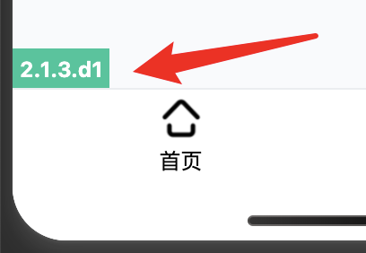
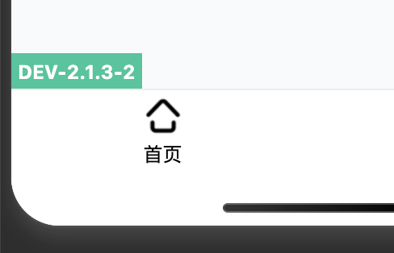

# 更优雅得管理小程序版本

最近我也是从头开发了一个小程序，其中最 boring 的大概就是发版。而在开发过程中，我也在发布版本这件事上琢磨了很久，目前总算是搞了个似乎不赖的方法。下面就按照开发流程讲一下我的心路历程。

## 第一步：引入环境变量

小程序版本管理最重要的一点就是要尽可能简单得区分不同的运行环境。由于小程序不支持类似环境变量的功能，因此需要开发者在代码层面手动控制。我们专门设置了 `config/env.js` 用于控制小程序环境，所有涉及运行环境的地方都要引入 `ENV` 常量。比如我们的接口：

```jsx
// config/env.js
// 可以根据自己的需要定义各种环境。比如我们定义了 DEV, STAGING, PROD 三种
export const ENV = 'DEV';

// config/constnts.js
import { ENV } from './env';
export const BASE_URL_API = ENV === 'DEV' ? 测试接口 : 正式接口;
```

每次发布新版时，都只需要更改 `ENV` 的值即可实现环境切换。

## 第二步：版本号机制

当小程序进入测试阶段后，我们通常需要发布专门的体验版给测试同事使用。但经常会出现这样的对话 🤦‍♀️：

```
测试同事：你改好了吗？
我：好了好了，已经提交新版了。
测试同事：还是没有啊？你啥时候提交的？
我：你打开小程序助手，五分钟前更新的那版。。。
```

并且，由于我们的 Bug 需要带上版本号在团队协作工具上进行记录，如果每次都记录体验版的发布时间，将会非常繁琐，因此我们确实需要一个可实施性更强的版本机制。

我们小程序会有一个三位的、严格遵循 [SemVer 规范](https://semver.org/lang/zh-CN/) 的主版本号，比如 `2.1.3`。想要区分测试版本，最简单的就是在这个主版本号后面再加一位。比如：`2.1.3.d1`，就代表这是用于测试的第一个版本，d 代表 DEV 环境。每次发布新的体验版后，都需要将后方的小版本号 + 1，直到测试完毕发布正式版 `2.1.3`。

由于打开小程序后没有任何关于版本的提示，因此我们还在小程序首页添加了显示当前版本号的小角标，方便开发人员和测试人员进行区分正在使用的版本。角标在小程序处于开发环境时显示，正式环境时隐藏。

因此 `config/env.js` 中需要维护两个常量：

```jsx
export const ENV = 'DEV';
export const VERSION = '2.1.3.d1';
```



至此，测试人员可以精确得针对某个版本的 Bug 进行记录，开发人员修复后，也可以记录在哪个版本修复完毕，方便进行回测。Nice！

但这是完美的方案吗？至此，我们每次发布新的版本，都需要：

1. 修改 `config/env.js` 中的版本号
2. 点击开发者工具中的上传按钮，在版本号一栏中输入 `config/env.js` 中的新版本号

这个流程还存在什么痛点呢？

1. 由于这两个步骤都是手动的，并且如果遇到频繁发布测试版本的情况，经常会由于疏忽导致这两个版本不一致，仍然会引起测试人员的困惑
2. 每次发布版本都这样改一通，对于开发人员来讲着实是一种痛苦

我们想要达到什么样的效果？

1. 一键切换运行环境。每次发布预发布版或正式版时，都需要修改 ENV 的值，而这个值必定是有限的几个，我们希望可以更简单得修改这个值
2. 自动维护小版本号。由于大部分时间我们发版的目的都是为了内部测试，而用户标记内部版本的小版本号只需要进行简单累加即可，因此完全可以考虑把这个过程给自动化掉

想清楚自己想要什么之后，开整！

## 第三步：引入 miniprogram-ci

实际上小程序提供了 miniprogram-ci 扩展包，我们只需要使用到其中的“上传”功能。官方文档 👇：

[概述 | 微信开放文档](https://developers.weixin.qq.com/miniprogram/dev/devtools/ci.html)

为了更好得实现目的，我们定义了一套新的版本号规范，由三部分组成：

1. 小程序运行环境。DEV, STAGING, PROD
2. 小程序主版本号。2.1.3
3. 用于开发和测试时内部使用的次版本号。1, 2, 3 递增。当小程序是正式版时，次版本号永远为 0

一个完整的版本号例子：



抛去使用 miniprogram-ci 自动上传的部分，主版本号只需要在开发前定义一次即可，而次版本号的维护完全可以通过读取上一次的版本简单 +1 得到。

因此我们可以写一个简单的 node 脚本，主要功能就是读取 env.js 的内容并修改，然后进行保存。当然，为了实现更高的自由度，我们还可以结合命令行参数，加亿点点的修饰 🤣。

话不多说直接放代码。脚本非常简单，就不做过多解释了。

```jsx
const fs = require('fs');
const ci = require('miniprogram-ci');
const { appid } = require('./project.config.json');
const { ENV, MAJOR_VERSION, ADORN_VERSION } = require('./src/config/env.cjs');

// =============================================================================
// 计算版本
// =============================================================================

const specifiedEnv = process.argv[2] || 'DEV';
const specifiedMajorVersion = process.argv[3];
const specifiedAdornVersion = process.argv[4];

const buildFullVersion = (env, major, adorn) => `${env}-${major}-${adorn}`;

console.log(
  '\x1b[36m%s\x1b[0m',
  `Original Version: ${buildFullVersion(ENV, MAJOR_VERSION, ADORN_VERSION)}`
);

const nextEnv = (() => {
  if (!specifiedEnv) return ENV;

  if (['DEV', 'd', '1'].includes(specifiedEnv)) {
    return 'DEV';
  } else if (['STAGING', 's', '2'].includes(specifiedEnv)) {
    return 'STAGING';
  } else if (['PROD', 'p', '3'].includes(specifiedEnv)) {
    return 'PROD';
  } else {
    throw 'ERROR ENV!';
  }
})();
const nextMajorVersion = specifiedMajorVersion
  ? specifiedMajorVersion
  : MAJOR_VERSION;
const nextAdornVersion = (() => {
  // 如果是生产环境，则此版本号永远为 0
  if (nextEnv === 'PROD') {
    return 0;
  }
  // 判断主版本和环境是否变化，如果变化，则重置为 1
  else if (nextMajorVersion !== MAJOR_VERSION || nextEnv !== ENV) {
    return 1;
  }
  // 主版本无变化，版本号默认 + 1
  else {
    return specifiedAdornVersion ? specifiedAdornVersion : +ADORN_VERSION + 1;
  }
})();

const nextFullVersion = buildFullVersion(
  nextEnv,
  nextMajorVersion,
  nextAdornVersion
);
console.log('\x1b[36m%s\x1b[0m', `Next Version: ${nextFullVersion}\n`);

// =============================================================================
// 生成环境变量的配置文件
// =============================================================================

console.log('\x1b[36m%s\x1b[0m', `Generating the env configuration file...`);

fs.writeFileSync(
  './src/config/env.cjs',
  `module.exports = {
  ENV: '${nextEnv}',
  MAJOR_VERSION: '${nextMajorVersion}',
  ADORN_VERSION: '${nextAdornVersion}'
};\n`
);

fs.writeFileSync(
  'src/config/env.js',
  `export const ENV = '${nextEnv}';
export const MAJOR_VERSION = '${nextMajorVersion}';
export const ADORN_VERSION = '${nextAdornVersion}';\n`
);

console.log('\x1b[32m%s\x1b[0m', `Configuration file generated!\n`);

// =============================================================================
// 上传
// =============================================================================

console.log('\x1b[36m%s\x1b[0m', `Ready to upload...`);

const project = new ci.Project({
  appid,
  type: 'miniProgram',
  projectPath: './src',
  privateKeyPath: './mp-upload.private.key',
  ignores: ['**/*.d.ts', '**/*.md'],
});

(async () => {
  await ci.upload({
    project,
    version: nextFullVersion,
    desc: `Uploaded at ${new Date().toLocaleString()}`,
    setting: {
      es6: true,
      es7: true,
      minify: true,
      autoPrefixWXSS: true,
    },
    // Tips: 如果不想看一大堆冗长的 log，就加上这一句吧
    onProgressUpdate() {},
  });

  console.log(
    '\x1b[32m%s\x1b[0m',
    `Uploaded! New version is: ${nextFullVersion}`
  );

  process.exit();
})();
```

因此 `config/env.js` 内容也就变成了：

```jsx
export const ENV = 'DEV';
export const MAJOR_VERSION = '2.1.3';
export const ADORN_VERSION = '2';
```

接着，我们可以在 package.json 中添加一条命令，这样就可以通过 npm 调用了：

```json
"scripts": {
  "upload": "node mp-upload.js"
},
```

脚本使用示例：

- `npm run upload`: 取上一个 Env，MajorVersion 保持不变，AdornVersion + 1
- `npm run upload d`: Env 设为开发环境，MajorVersion 保持不变，AdornVersion + 1
- `npm run upload d 2.1.3`: Env 设为开发环境，MajorVersion 设为参数中的版本，并且如果 MajorVersion 不变，AdornVersion + 1，否则重置为 1
- `npm run upload d 2.1.3 1`: Env 设为开发环境，MajorVersion 设为参数中的版本，AdornVersion 设为参数中的版本

Ohhhhhhhh！看起来很棒！

## 还能再智能点吗？

当然！

小程序发版最大的痛点就是需要在开发者工具中手动上传，但有了这个脚本，就可以接入任何我们需要的自动化构建流程了～

比如，我们可以编写简单的 Git Hooks，在分支并入 develop 时自动执行 `npm run upload d` 发布用于测试新的体验版，并入 release 时执行 `npm run upload s` 发布预发布版，而并入 master 自动执行 `npm run upload p` 发布准备提交审核的正式版。
