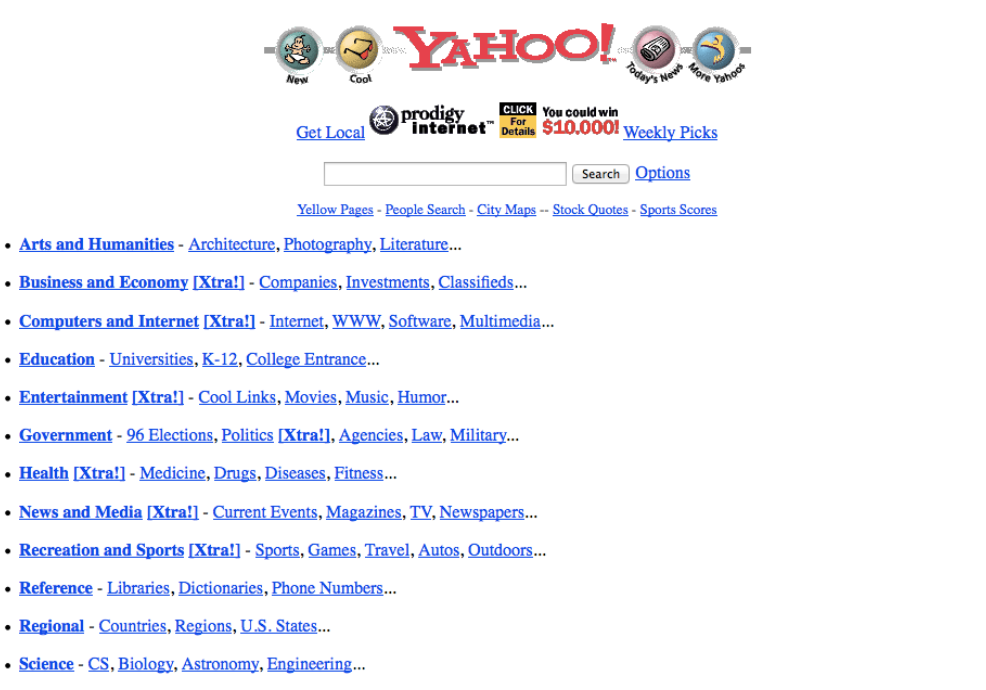
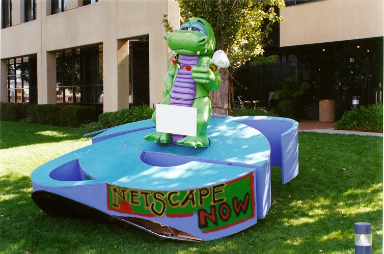
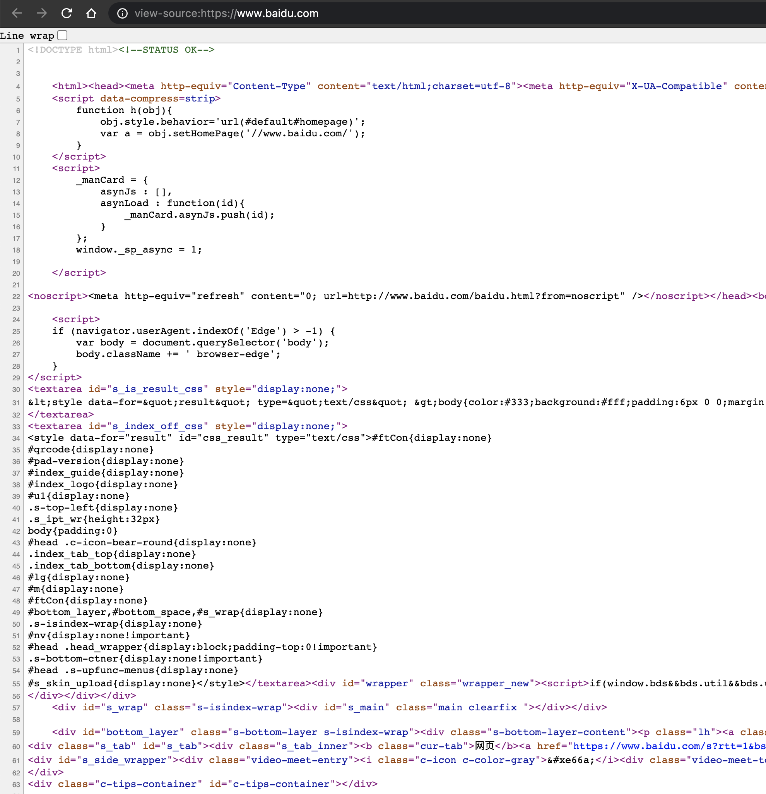
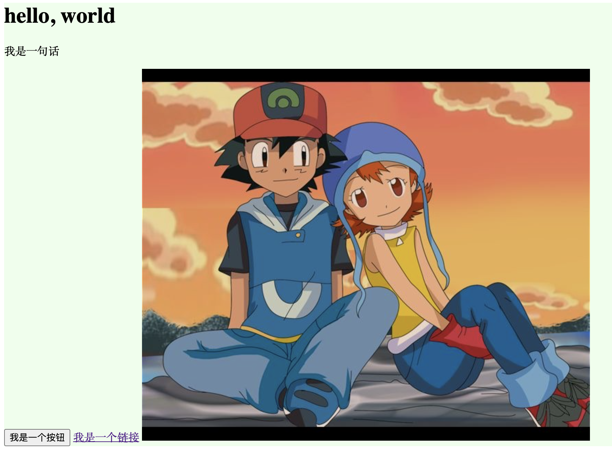
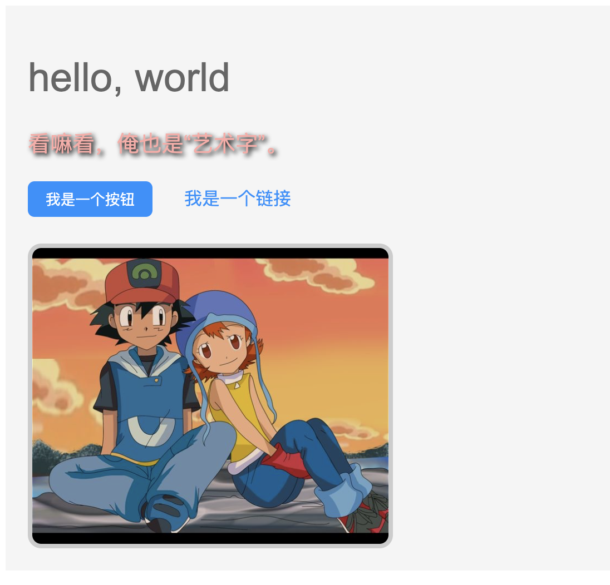
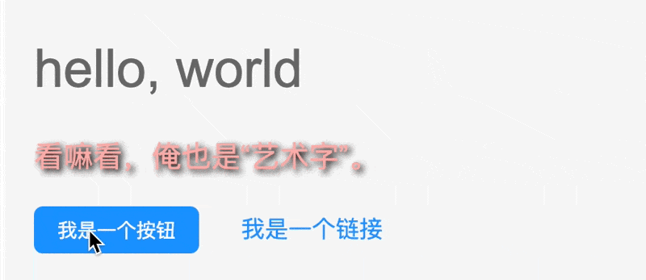

# 昨天

## 从计算机到浏览器

让我们把时间倒回战火纷飞的二战时期。美国军方为了提高炮弹的精准度，需要结合炮弹、风向、气压甚至是重力加速度等一大堆参数绘制弹道轨迹表，而当时的手摇式计算器已经无法满足这么庞大的计算需求了，于是乱七八糟的一通折腾，1946 年，世界上第一台通用电子计算机 ENIAC 在美国宾夕法尼亚大学诞生了 (给 ENIAC 添加“通用”定语是因为在它之前还有一台简称为 ABC 的电子计算机)。再后来，罗伯特·诺伊斯发明了集成电路，推动了计算机小型化进程。你可能没有听过这个人，但一定听过他后来创办的公司：Intel。

正所谓色情和暴力是人类进步的阶梯，有多少推动文明前进的发明都来源于愚蠢的战争。

时间来到 1968 年，美国国防部 (DARPA) 基于冷战的背景，琢磨着搞一套能让世界各地的计算机相互通信的技术，简称 ARPANET，也就是俗称的 "阿帕网"。1969 年，ARPANET 正式投入使用，最先加入的是美国 4 所大学的主要计算机。1969 年 10 月 29 日，加州大学洛杉矶分校和斯坦福大学进行了基于 ARPANET 的第一次通讯，但仅仅传输了 `LO` 两个字母。这是因为本来打算传输 `LOGIN`，结果传输到第三个字母时系统崩溃了。


当然，我可不想在这里把整个维基百科都搬下来。你只需要知道，不久后 TCP/IP 协议出现了，基于 TCP/IP 协议的 Internet 也出现了。至于什么 TCP/IP 的三次握手四次挥手这样的八股文概念，这不够有趣，所以并不会出现在我们的故事里。

在下一个时间点到来前还有个值得一提的事情。1987 年，中国高能物理研究院组长吴为民发送了中国的第一封电子邮件：

> Across the Great Wall we can reach every corner in the world.

以现在的视角来看，这句话似乎带有着那么一丝前瞻性，毕竟现在想看世界总得越过“长城”。

时间继续前进。1989 年，英国科学家蒂姆·伯纳斯-李 (Tim Berners-Lee) 发明了万维网。等等，怎么又有个万维网？和互联网的区别是什么？简言之，互联网是基础架构，而万维网是一种更上层的“互联”方式。属于互联网的子集，万维网希望使用通过链接的形式把互联网上的各种资源进行组合，让使用者更方便得获取互联网上的各种资源。还是不明白？那请你想象一个这样一个场景：

你想要了解一下股票，大概会先打开浏览器，打开百度 (或者 Google)，然后输入股票两个字，敲回车，百度的页面上就会排列一大堆股票相关的信息。

::: warning
这里只是举个例子，请务必不要使用百度搜索股票、金融、医疗等相关内容，尤其是你的百度账号已经绑定了手机号时。
:::

这时你看到有个知乎的回答看起来不错，于是你点击标题，页面一转，浏览器带你来到了知乎的网站下。好的，停🤚，仔细想想这个操作，你通过一个链接，从百度的网站进入了知乎的网站，如果所有的网站都这样组合起来，互联网的边界是不是看起来触手可及？能达到这样的效果，还要归功于伯纳斯-李的另外两个发明：超文本传输协议 (HTTP) 和超文本标记语言 (HTML)。你能看到的任何一个网页，本质上都是浏览器借由 HTTP 请求从网络上的某一个地方取回了一段 HTML 代码，然后浏览器逐行翻译这些代码，就形成了你能看到的网页。

早期的互联网哪有什么搜索引擎，大家想要访问某个网站，只能直接输入网址或者通过链接进入。这也就促成了早期黄页、导航页和门户网站的大火，比如国外的雅虎 (Yahoo!)，国内的搜狐等。这个时代也被称为 web1.0 时代。



关于雅虎可以多提两句。1997 年，有两个名叫谢尔盖·布林 (Сергей Брин) 和拉里·佩奇 (Larry Page) 的小伙子找上雅虎，推销他们发明的搜索引擎技术 BackRub，开价 100 万美元。结果雅虎创始人杨振远和大卫·费罗 (David Filo) 拒绝了他们。次年，谢尔盖·布林和拉里·佩奇将 BackRub 更名为 Google 并创建了公司。现如今 Google 已经发展成为了世界上规模最大的公司之一，而当年风光无限的雅虎现在却早已被他人收购。

历史总是惊人的相似。曾经马化腾也拿着 QQ 想以 300 万 (也有一说是 100 万) 卖给自己的偶像张朝阳，但张朝阳最终并没有收购。收购未能达成的原因众说纷纭，但最终的结果就是张朝阳错失了腾讯，有如雅虎错失了 Google。类似的故事还有很多，Nokia 和 iPhone，索尼的 Walkman 和 MP3，柯达的胶卷相机和数码相机的崛起... 短短几十年里，我们见证了太多的此起彼伏。身处科技爆炸式发展的年代，变化往往就在刹那之间，从来就没有永远的巨头。

让我们把牛宝宝扯回来。HTTP 等技术和浏览器的关系就如同饺子和笊篱，虽然我们不知道饺子和笊篱是不是一起发明的，但是伯纳斯-李爵士在发明 HTTP 等技术的同时还开发了世界上第一个浏览器 WorldWideWeb，这使得人们上网冲浪的门槛大幅降低。

1994 年，网景 (Netscape) 公司在加州的山景城成立，并推出了一款名为 Netscape Navigator 的浏览器，一度占据了 90% 的浏览器市场份额。随后不久，微软也推出了自己的 Internet Explore 浏览器 (就是 IE 浏览器)，[第一次浏览器大战](https://zh.wikipedia.org/wiki/%E6%B5%8F%E8%A7%88%E5%99%A8%E5%A4%A7%E6%88%98#%E7%AC%AC%E4%B8%80%E8%BC%AA%E5%A4%A7%E6%88%B0) 拉开序幕。下面是我从维基百科上摘录的一段非常有意思的小故事。

> 1997年10月，Internet Explorer 4 版正式推出，并在旧金山举行产品发表会，而引人注目的地方便是竖立了一个10呎长的巨型"e"标志。第二天早上，Netscape的员工们在前方的草坪上发现了巨型标志，上面写着 “From the IE team ... We Love You”。Netscape员工立刻把巨型标志推翻，并放上其吉祥物Mozilla恐龙，恐龙手上纸牌写着“Netscape 72, Microsoft 18”，代表当时的浏览器市场占有率。



但是仅仅推倒 IE 的 Logo 并不能挽回网景浏览器市场占有率节节走低的局面。是的你没有听错，就是那个**现在**难用至极，被无数前端开发者唾骂的 IE 浏览器。最终 IE 浏览器大获全胜。1998 年，网景公司被收购。

能看到我写的文字，说明你大概率正在使用 Chrome，Firefox，Safari，Edge 或者 360 浏览器，反正最起码应该不是 IE 浏览器了。IE 由于安全问题、只能随 Windows 版本升级等问题，逐渐被 Google 的 Chrome 浏览器抢占了大量市场份额。截止 2020 年 11 月，IE 市场份额仅为 1.13% (数据来源 [维基百科](https://en.wikipedia.org/wiki/Usage_share_of_web_browsers))。所以如果你真的还在使用 IE，Please give up!

好了，浏览器已经上场，我们前端开发工程师也该站上历史的舞台了。

## HTML

上面我们提到，浏览器显示网页的核心原理就是逐行解析 HTML 代码。那么 HTML 究竟是什么？我相信你都在网页上点击过鼠标右键，而菜单里通常有一项叫做：`查看网页源代码`。如果你还没有出于好奇心点击过，可以现在随便打开一个网页试一下。一般情况下，浏览器都会显示出一整页的代码。以百度为例：



你现在还不需要看懂上面这一堆花花绿绿的东西。你只需要知道，HTML 最核心的功能就是承载网页的结构和内容。下面是一段非常非常简单的 HTML 代码：

```html
<div style="background-color: #edffec;">
  <h1>hello, world</h1>
  <p>我是一句话</p>
  <button>我是一个按钮</button>
  <a href="https://www.baidu.com/">我是一个链接</a>
  
</div>
```

这段代码在浏览器中会表现为：



你会发现，把文字用类似 `<h1></h1>` 这样的符号给“圈”起来之后，就会在浏览器上展示出不同尺寸的文字，而 `` 则会展示成一张图片。这些带尖括号的字符被称为 **HTML 标签**。不同的标签能够呈现不同的行为和样式，只要你按照 HTML 的规则使用和组合这些标签，就能排版出最基本的网页了。比如，`<h1></h1>` 标签应该用在网页的标题上，`<p></p>` 标签应该用在网页的段落上。

HTML 一直在发展，有些新标签被添加进来，也有一些标签被废弃了。你可以在 MDN 的 [HTML 元素参考](https://developer.mozilla.org/zh-CN/docs/Web/HTML/Element) 找到全部标签。不要害怕，你并不需要把全部的标签背下来，开发过程中我们也只会使用其中一小部分而已。

## CSS

虽然每种标签都带有不同的样式，但只靠标签自身的样式组合出来的网页实在是太丑了 (以现在的眼光来看)，于是就有人开始琢磨怎么让网页变得好看点。最终被普遍认可的是哈肯·维姆·莱 (Håkon Wium Lie) 在 1994 年首次提出的 **层叠样式表 (Cascading Style Sheets)** 概念，也被简称为 **CSS**。Opera 浏览器 (现在已经被奇虎 360 收购) 和 IE 浏览器在相当早期就开始支持 CSS，但 IE 似乎对 CSS 并不上心，Bug 很多，甚至直到随 Windows XP 一起发行的 IE6 仍存在非常多严重的 CSS Bug (比如最经典的双倍边距问题)。

那么 CSS 是如何工作的呢？首先 CSS 需要去选择一个 HTML 元素，然后通过一些非常语义化的 CSS 代码去修改 HTML 元素的样式。让我们把上面的代码加上一点点 CSS (被 `<style></style>` 标签包裹起来的代码)：

```html
<style>
  .wrapper {
    background-color: snow;
    font-family: Arial, Helvetica, sans-serif;
  }
  h1 {
    color: #666;
    font-size: 36px;
    font-weight: lighter;
  }
  p {
    color: #ffaaa7;
    font-size: 20px;
    text-shadow: black 0.1em 0.1em 0.2em;
  }
  button {
    height: 32px;
    padding: 0 15px;
    border-radius: 6px;
    border: 1px solid #1890ff;
    color: #fff;
    background-color: #1890ff;
  }
  .link {
    margin-left: 24px;
    color: #1890ff;
    text-decoration: none;
  }
  #cover {
    margin-top: 24px;
    width: 320px;
    border-radius: 12px;
    border: 4px solid #ccc;
    display: block;
  }
</style>

<div class="wrapper">
  <h1>hello, world</h1>
  <p>看嘛看，俺也是“艺术字”。</p>
  <button>我是一个按钮</button>
  <a class="link" href="https://www.baidu.com/">我是一个链接</a>
  
</div>
```

最终的效果是：



啊哈，是不是好多了！好吧我知道并没有好太多，毕竟这里只是稍微演示一下。仔细看看代码你会发现，我在 CSS 中有直接写标签名字的，也有用 `.link` 的，还有用 `#cover` 的。事实上这几种写法都是为了选择对应的 HTML 元素。选择 HTML 元素的方式有很多种，但也不要怕，这三种已经能涵盖绝大部分使用场景了。

## JavaScript

上一节我们提到 Opera 和 IE 对 CSS 的支持比较积极，那么同时期的网景浏览器在干什么呢？其实人家并没有摸鱼，他们的重心正放到网页脚本语言的开发上。

有了 HTML 和 CSS，我们已经可以构建足够漂亮美观的网页了，但这时候的网页是 “死” 的，即用户的任何交互，网页都无法进行响应。仍然以知乎举例，当你在网页版知乎上看到一张图片，觉得看不太清时，可以点击这张图片，这张图片就会“浮起来”，并且放大显示。这个过程中，我们就多次借助了 **JavaScript** (简称 **JS**) 的力量，比如处理你的鼠标点击，又比如在网页中心再创建一个存放图片的 `` 标签。JS 非常强大，它可以随心所欲得操纵 HTML 和 CSS (和更多资源)，实现各种动态效果。虽然 HTML 和 CSS 同样强大且不可或缺，但不得不承认，现代的前端工程师更大一部分时间都在和 JS 打交道。

1995 年，网景招聘了布兰登·艾克 (Brendan Eich)，艾克仅使用了 10 天时间就设计出了现代 JavaScript 的雏形。很多人应该都听说过 Java 语言，会很好奇 Java 和 JavaScript 有什么关系。关于这个问题，有一句俏皮话广为流传：

> Java 和 JavaScript 的关系，就如同雷锋和雷峰塔的关系。

当初 Java 语言大火，网景希望能蹭个热度，于是就把当时叫做 LiveScript 的语言更名为了 JavaScript，并且在语法上尽可能贴近 Java。

::: tip 扩展阅读
只要稍微了解这两门语言，你就会发现他们的天差地别。其中最大的区别就是 Java 是基于 class 的强 OOP 语言，而 JS 则借鉴了 Self 语言的原型思想和 Scheme 语言的函数式编程思想。
:::

这里我们也给上面的 Demo 添加一点点 JS (被 `<script></script>` 标签包裹起来的代码)，功能非常简单，就是当点击按钮时，修改按钮里面的文字。

```html
<div class="wrapper">
  <h1>hello, world</h1>
  <p>看嘛看，俺也是“艺术字”。</p>
  <button id="btn">我是一个按钮</button>
  <a class="link" href="https://www.baidu.com/">我是一个链接</a>
  
</div>

<script>
  var btn = document.getElementById('btn');
  btn.onclick = function() {
    this.innerText = '别点了别点了，再点就傻了';
  }
</script>
```



网景推出 JavaScript 时正值第一次浏览器大战如火如荼，为了迎战网景的 JavaScript，微软也推出了自家的脚本语言 JScript，并且添加了一大堆的专属特性。咦？等等，网景浏览器不是被 IE 打败了吗？那为什么现在大家常说的 JS 是指 JavaScript 而不是 JScript 呢？

## 蛮荒时代与 W3C

前端开发工程师经常抱怨的一件事就是同一段代码在不同浏览器上的行为表现不一致，也就是所谓的 “兼容性问题”。这种兼容性问题非常折磨人，~~毕竟错的不是我，而是这个世界~~，而我们又不得不去处理他们。但当我们勾回头去看上世纪 90 年代的历史，就会发现那个年代才是网页开发的 “蛮荒时代”。

> 微软公司于 1995 年首次推出 Internet Explorer，从而引发了与 Netscape 的浏览器大战。微软对 Netscape Navigator 解释器进行了逆向工程，创建了 JScript，以与处于市场领导地位的网景产品同台竞争。JScript 也是一种 JavaScript 实现，这两个 JavaScript 语言版本在浏览器端共存意味着语言标准化的缺失，发展初期，JavaScript 的标准并未确定，同期有网景的 JavaScript，微软的 JScript 双峰并峙。除此之外，微软也在网页技术上加入了不少专属对象，使不少网页使用非微软平台及浏览器无法正常显示，导致在浏览器大战期间网页设计者通常会把 “用 Netscape 可达到最佳效果” 或 “用 IE 可达到最佳效果” 的标志放在主页。
>
> ——摘录自 [维基百科的 JavaScript 词条](https://zh.wikipedia.org/wiki/JavaScript#%E5%BE%AE%E8%BB%9F%E6%8E%A1%E7%B4%8D)

如果只基于上面这段话大胆推测，也许能猜到现在的招聘网站上还会出现：Chrome 前端工程师、Firefox 前端工程师、360 浏览器前端工程师等等这样的岗位。但事实上这样分崩离析的场景并没有出现。对于不是开发者的普通用户，Chrome，Firefox 或是 360 浏览器之间似乎只有颜值的差异。

这就不得不感谢 W3C 了，W3C 全程 World Wide Web Consortium，前三个字母都以 W 打头所以缩写成 W3。W3C 还是由伯纳斯-李创立的，并且一直是委员会的主任。W3C 致力于制定一系列的规范对 Web 技术进行标准化，不至于出现过于离谱的不兼容问题。由于这些规范非常重要，因此这些规范都是由各个巨头 (IBM, Apple) 联合参与制定的。如果你有兴趣，可以查看 W3C 的 [官方网站](https://www.w3.org/)。

::: tip 关于伯纳斯-李老爷子
老爷子 2004 年授封为大英帝国爵士；在 2016 年获得图灵奖。

2021 年，老爷子发表了 “网络世界” 已经走入歧途的观点。他认为，太多的权力和太多的个人数据，都被掌握在在几个互联网巨头等科技巨头手中，他希望去创造一个新方式，能让人们自己掌握个人数据。

我个人非常敬佩老爷子，他真的是互联网最本真愿景的代表人物之一了。
:::

## ECMAScript

回到 JavaScript 小节末尾留下的问题。1996 年 11 月，网景公司正式向 ECMA (欧洲计算机制造商协会) 提交了语言标准，ECMA 基于 JavaScript 制定了标准化的语言规范 ECMAScript (简称 ES)，所有浏览器厂商都根据 ES 规范修订自家的 JavaScript 解释引擎。这样就解释了为什么绝大多数 JS 代码在不同的浏览器下表现基本一致，但又会存在略微的差异。举个不太恰当的例子，ES 规范就像饮料瓶上的建议零售价，不同的店铺仍然可以坐地起价或者清仓甩卖。因此我们常说：JavaScript 只是 ECMAScript 的一种实现 (但现在大部分人也都混用了)。

ES 仍在不断更新，并且 ECMA 还每年 6 月份正式发布一次新的版本。其中最显著的一次更新就是 2015 年发布的 ECMAScript 6.0，也被称为 ECMAScript 2015 (简称 ES6)。ES6 添加了巨量的新特性，其中很多特性直到现在都尚未被各大浏览器支持。这也就导致了很多人不理解为什么网上的新鲜框架里有各种 `import`，`class` 语法，但随便打开个网页的源代码却完全看不到这些语法。

ES6 目前基本已经成为一个泛指，一般被解释成 5.1 版本之后的所有 ECMAScript 规范的总称。

但还记得上面说过的吗？很多 ES6 语法并不能直接在浏览器中运行，难道我们只能干巴巴的等浏览器去适配吗？并不是这样的。现在已经有了非常成熟的工具去把高版本的语法翻译回浏览器“认识”的低级语法了，大部分场景我们都可以无痛拥抱 ES6+ 语法。

至于如何翻译呢？不要慌，在后面的章节里我会好好解释的。

(To be continued...)